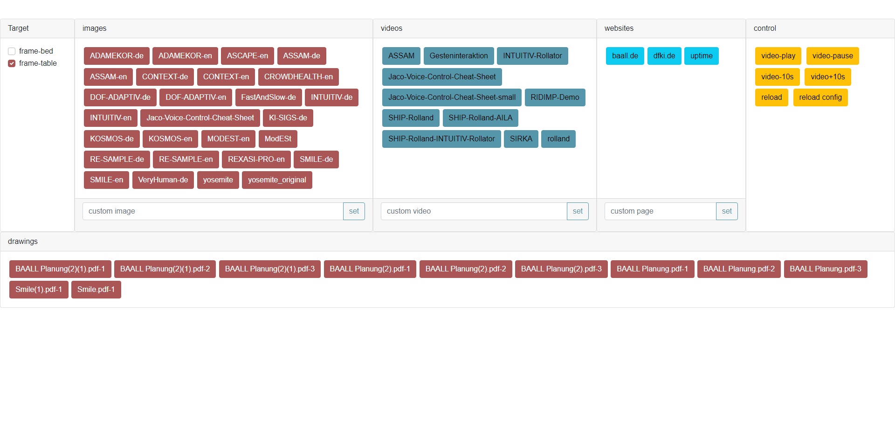

# KosmoS Web Kiosk Plugin


## Description
This plugin is used in the BAALL to control multiple browserconnected screens.

## Configuration
To configure this plugin a config file "config/kiosk/targets.json" is used (see [example](config/kiosk/targets.json.dist)).

The configuration consists of multiple keys:

### image
These are simple images that will be shown with the \ tag.
Each entry consists of **name** and **src**, where **name** is the name shown in the UI and **src** what will be shown after clicking the button.

### drawing
These are simple images that will be shown with the \ tag.
Each entry consists of **name** and **src**, where **name** is the name shown in the UI and **src** what will be shown after clicking the button.

### video
These are videos that will be shown with the \<video\> tag.
Each entry consists of **name** and **src**, where **name** is the name shown in the UI and **src** what will be shown after clicking the button.

### page
These are websites that will be shown with the \<iframe\> tag.
Each entry consists of **name** and **src**, where **name** is the name shown in the UI and **src** what will be shown after clicking the button.

### remote
This is a list of remote sources that themselves should return a JSONObject with the keys **image**,**drawing**,**video** as above.
This can be used to dynamically add new content without access to the real KosmoS server.
We use it in the BAALL for our project images which are generated from powerpoint, our project videos and our drawings which are automatically created and converted from the saved drawings on our touch enabled displays.

## Usage
To use the KosmoS Kiosk plugin each display should open a browser to http(s)://\<yoururl\>/kiosk/?target=\<displayname\>.
For example:
* https://example.com/kiosk/?target=frame-table
* https://example.com:18080/kiosk/?target=frame-bed

This will initially just show an empty white page.

To control what should be shown visit
http(s)://\<yoururl\>/kiosk/admin.html
For example:
* https://example.com/kiosk/admin.html
* https://example.com:18080/kiosk/admin.html
You will need to login with your KosmoS credential first, afterwards you'll a webinterface like the following
.
Here you can select the targets to control, and what action to do.

## compile yourself

If you want to compile it yourself you can do so with

```shell
mvn clean package
```

This should create a zip in the target folder.

Just drop this zip file to the "plugins" folder of the KosmoS platform.


